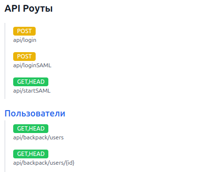
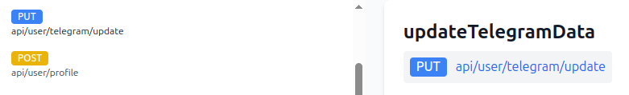
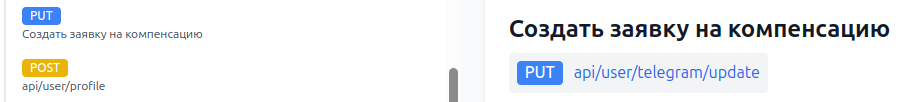
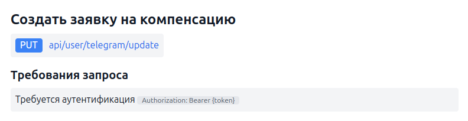

# Laravel API Documentation Generator


Этот пакет автоматически анализирует контроллеры и маршруты Laravel, извлекая информацию о группах, именах, middleware, кодах ответов и формируя удобную документацию в формате JSON.

## 📦 Установка

```bash
composer require wfgm5k2d/php-light-doc
```
## 📦 Опубликуйте все файлы

```bash
php artisan vendor:publish --provider='Wfgm5k2d\PhpLightDoc\Providers\PhpLightDocServiceProvider'
```

## 🚀 Использование
После установки в Laravel появится команда для генерации документации:

```bash
php artisan api-docs:generate
```
Документация будет сохранена в корне проекта `/api_documentation.json` и доступна по маршруту `/doc`.

## 📝 Аннотации и атрибуты
Вы можете дополнительно аннотировать контроллеры и методы для более точного описания API.

### Группировка контроллеров
Группы помогают структурировать документацию по тематическим разделам.
Вы можете дать название группе контроллера. По умолчанию название не указывается


Вы можете добавить название группы
#### Через комментарий:

```php
// group Пользователи
final class UserController extends Controller
```
#### Или атрибут:

```php
#[DocGName('Пользователи')]
final class UserController extends Controller
```


## Описание маршрутов
По умолчанию названия у роута нет

но вы можете задать понятное название маршруту:

#### Через комментарий:

```php
// name Создать заявку на компенсацию
public function createApplication(Request $request): JsonResponse
```
#### Или атрибут:

```php
#[DocRName('Создать заявку на компенсацию')]
public function createApplication(Request $request): JsonResponse
```


## Требования middleware
Если метод требует авторизации или специальных заголовков, укажите это явно.

#### Через комментарий:

```php
// middleware-name Требуется аутентификация
// middleware-value Authorization: Bearer {token}
final class SecureController extends Controller
```
#### Или атрибут:

```php
#[DocMiddlewareName('Требуется аутентификация', 'Authorization: Bearer {token}')]
final class SecureController extends Controller
```


По умолчанию проверяется такой набор middleware
```
auth
throttle
can
requires
```

## Коды ответов
По умолчанию код ответа будет 200 если не указано других.
Пакет ищет коды ответов в таких конструкциях:
```php
return response()->json()
return new JsonResponse([])
return new JsonResponse([], Response::HTTP_...)
return new JsonResponse([], 200)
```
Вы можете самостоятельно указать доступные коды ответов если они не определились

#### Через комментарий:

```php
// response-codes 200 404 500
public function getUserData(Request $request): JsonResponse
```

#### Или атрибут:

```php
#[DocResponseCodes([200, 404, 500])]
public function getUserData(Request $request): JsonResponse
```

## 🔄 Генерация и просмотр документации
Запустите команду генерации:

```bash
php artisan api-docs:generate
```

Откройте `/doc` в браузере для просмотра.

Документация обновляется автоматически при каждом запуске команды.

Этот пакет упрощает процесс документирования API, обеспечивая структурированный и удобочитаемый формат данных. 🚀

Этот код включает:
- Красивые badges в шапке
- Четкое разделение на секции
- Подсветку кода с указанием языков
- Эмодзи для визуального выделения разделов
- Хорошую читаемость и структуру
- Выделение важной информации (например, команды)
